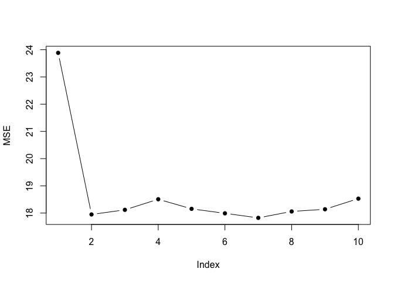

Cross Validation Example
================
Nishan Mudalige
2022-10-01

## Cross-Validation

### Validation Set Approach

Replicate the results in Figure 5.2

``` r
library(ISLR)
data(Auto)

set.seed(6)

n = nrow(Auto)
MSE = NULL

training_set_indices = sample(n, n/2, replace = F)
validation_set_indices = (1:n)[!(1:n %in% training_set_indices)]

training_set = Auto[training_set_indices, ]
validation_set = Auto[validation_set_indices, ]

for(i in 1:10){
  
  n_valid = nrow(validation_set)

  model = lm(mpg ~ poly(horsepower, i), data = training_set)

  fitted_values = predict(model, validation_set)

  MSE[i] = (sum((validation_set$mpg - fitted_values)^2)) / (n_valid - length(model$coefficients))
}

plot(MSE, type = "b", pch = 16)
```

<!-- -->

``` r
set.seed(1)

MSE_list = NULL

for(i in 1:10){
  
  training_set_indices = sample(n, n/2, replace = F)
  validation_set_indices = (1:n)[!(1:n %in% training_set_indices)]
  
  training_set = Auto[training_set_indices, ]
  validation_set = Auto[validation_set_indices, ]  
  
  for(j in 1:10){
    
    n_valid = nrow(validation_set)
    
    model = lm(mpg ~ poly(horsepower, j), data = training_set)
    
    fitted_values = predict(model, validation_set)
    
    MSE[j] = (sum((validation_set$mpg - fitted_values)^2)) / (n_valid - length(model$coefficients))
  }
  
  MSE_list[[i]] = MSE
}


colour_vec = adjustcolor(rainbow(10), alpha = 0.65)
plot(MSE_list[[1]], type = "b", pch = 16, col = colour_vec[1], ylim=c(16,25))

for(i in 2:9){
  lines(MSE_list[[i]], type="b", pch = 16, col = colour_vec[i])  
}
```

<!-- -->

<!--
## R Markdown

This is an R Markdown document. Markdown is a simple formatting syntax for authoring HTML, PDF, and MS Word documents. For more details on using R Markdown see <http://rmarkdown.rstudio.com>.

When you click the **Knit** button a document will be generated that includes both content as well as the output of any embedded R code chunks within the document. You can embed an R code chunk like this:
-->
<!--

```r
summary(cars)
```

```
##      speed           dist       
##  Min.   : 4.0   Min.   :  2.00  
##  1st Qu.:12.0   1st Qu.: 26.00  
##  Median :15.0   Median : 36.00  
##  Mean   :15.4   Mean   : 42.98  
##  3rd Qu.:19.0   3rd Qu.: 56.00  
##  Max.   :25.0   Max.   :120.00
```
-->
<!--
## Including Plots

You can also embed plots, for example:
-->
<!--```{r pressure, echo=FALSE} -->
<!--plot(pressure) -->
<!--``` -->
<!--
Note that the `echo = FALSE` parameter was added to the code chunk to prevent printing of the R code that generated the plot.
-->
