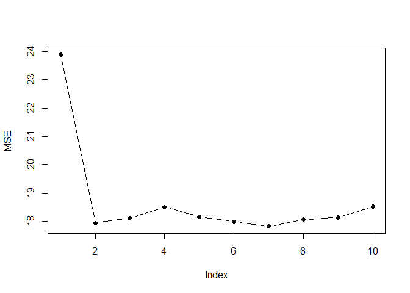

Replicating Some Results from An Introduction to Statistical Learning
(2nd Edition) - Chapter 5: Resampling Methods
================
Nishan Mudalige
2022-10-01
Source:An Introduction to Statistical Learning (2nd Edition) by Hastie and Tibshirani
``` r
knitr::opts_chunk$set(echo = TRUE)
```

## Cross-Validation

``` r
# Required libraries for data analysis

library(ISLR)
```

    ## Warning: package 'ISLR' was built under R version 4.1.3

``` r
library(ISLR2)
```

    ## Warning: package 'ISLR2' was built under R version 4.1.3

    ## 
    ## Attaching package: 'ISLR2'

    ## The following objects are masked from 'package:ISLR':
    ## 
    ##     Auto, Credit

``` r
library(boot)
library(bestglm)
```

    ## Warning: package 'bestglm' was built under R version 4.1.3

    ## Loading required package: leaps

    ## Warning: package 'leaps' was built under R version 4.1.3

``` r
library(npreg)
```

    ## Warning: package 'npreg' was built under R version 4.1.3

    ## 
    ## Attaching package: 'npreg'

    ## The following object is masked from 'package:boot':
    ## 
    ##     boot

### Validation Set Approach

Replicate the results in Figure 5.2

``` r
data(Auto)

set.seed(6)

n = nrow(Auto)
MSE = NULL

training_set_indices = sample(n, n/2, replace = F)
validation_set_indices = (1:n)[!(1:n %in% training_set_indices)]

training_set = Auto[training_set_indices, ]
validation_set = Auto[validation_set_indices, ]

for(i in 1:10){
  
  n_valid = nrow(validation_set)

  model = lm(mpg ~ poly(horsepower, i), data = training_set)

  fitted_values = predict(model, validation_set)

  MSE[i] = (sum((validation_set$mpg - fitted_values)^2)) / (n_valid - length(model$coefficients))
}

plot(MSE, type = "b", pch = 16, ylab = "MSE")
```

<!-- -->

``` r
set.seed(1)

MSE_list = NULL

for(i in 1:10){
  
  training_set_indices = sample(n, n/2, replace = F)
  validation_set_indices = (1:n)[!(1:n %in% training_set_indices)]
  
  training_set = Auto[training_set_indices, ]
  validation_set = Auto[validation_set_indices, ]  
  
  for(j in 1:10){
    
    n_valid = nrow(validation_set)
    
    model = lm(mpg ~ poly(horsepower, j), data = training_set)
    
    fitted_values = predict(model, validation_set)
    
    MSE[j] = (sum((validation_set$mpg - fitted_values)^2)) / (n_valid - length(model$coefficients))
  }
  
  MSE_list[[i]] = MSE
}


colour_vec = adjustcolor(rainbow(10), alpha = 0.65)
plot(MSE_list[[1]], type = "b", pch = 16, col = colour_vec[1], ylim=c(16,25), ylab = "MSE")

for(i in 2:9){
  lines(MSE_list[[i]], type="b", pch = 16, col = colour_vec[i])  
}
```

<!-- -->

### Leave One Out Cross Validation (LOOCV)

Replicate the result in the right left panel in Figure 5.4

``` r
set.seed(9)

X = Auto$horsepower
Y = Auto$mpg

loocv_list = NULL
cv_data = NULL

for(i in 1:10){
  cv_data = cbind(cv_data, X^i)
  loocv_list[[i]] = LOOCV(cv_data, Y)  
}

loocv_df = do.call(rbind.data.frame, loocv_list)
names(loocv_df) = c("MSE", "SD of MSE")

plot(loocv_df$MSE, type = "b", pch = 16, ylab = "MSE")
```

<!-- -->

### K-Fold Cross Validation (LOOCV)

``` r
set.seed(12)

cv.error.list = NULL

for(i in 1:10){
  
  cv.error.10 <- rep(0, 10)
  
  for (j in 1:10) {
    glm.fit <- glm(mpg ~ poly(horsepower, j), data = Auto)
    cv.error.10[j] <- cv.glm(Auto, glm.fit, K = 10)$delta[1]
  }
  cv.error.list[[i]] = cv.error.10
}

# cv.error.list

colour_vec = adjustcolor(rainbow(10), alpha = 0.65)

plot(cv.error.list[[1]], type = "b", pch = 16, 
     col = colour_vec[1], ylim=c(18, 25),
     ylab = "MSE", xlab = "Degree of polynomial")

for(i in 2:9){
  lines(cv.error.list[[i]], type = "b", pch = 16, col = colour_vec[i])
}
```

<!-- -->

### Attempting to recreate figure similar to Figure 2.9

``` r
library(matlib)
```

    ## Warning: package 'matlib' was built under R version 4.1.3

``` r
# Visually estimating 4 points from 

x1 = 32;  y1 = 6
x2 = 40;  y2 = 7.1
x3 = 47;  y3 = 7.95
x4 = 70;  y4 = 9.25


A = rbind(c(1, x1, x1^2, x1^3),
          c(1, x2, x2^2, x2^3),
          c(1, x3, x3^2, x3^3),
          c(1, x4, x4^2, x4^3))

b = c(y1, y2, y3, y4)

ge_solve = gaussianElimination(A, b)

# Function to obtain coefficients of cubic polynomial
f = function(x){
  ge_solve[1,5]  +  ge_solve[2,5]*x  +  ge_solve[3,5]*x^2  +  ge_solve[4,5]*x^3
}

x = seq(0, 100, by=0.75)
y = sapply(x, f)

# plot(x, y, type = "l")

# Add some noise
sim_y = y + rnorm(length(y), 0, 0.25)
sim_x = x + rnorm(length(x), 0, 2)

# Create linear model
linear_model = lm(sim_y ~ sim_x)


# Create smoothing Spline
model_spline_A <- ss(sim_x, sim_y, nknots = 3)
model_spline_B <- ss(sim_x, sim_y, nknots = 10)

plot(x, y, xlab = "X", ylab = "Y")
points(sim_x, sim_y)
lines(sim_x, predict(linear_model, data.frame(sim_x)), col = "orange", lwd=2)
lines(x, model_spline_A$y, col = "lightblue", lwd = 2)
lines(x, model_spline_B$y, col = "springgreen3", lwd = 2)
```

<!-- -->

<!-- ### Variance biase tradeoff -->
<!-- https://towardsdatascience.com/understanding-the-bias-variance-tradeoff-165e6942b229 -->
<!-- The Error can be decomposed into the bias^2 + variance + some irreducible error -->
<!--
# Define training control
set.seed(123) 
train.control <- trainControl(method = "cv", number = 10)
# Train the model
model <- train(Fertility ~., data = swiss, method = "lm",
               trControl = train.control)
# Summarize the results
print(model)


# library(kfoldcv4ts)
# kfoldcv4ts::accuracy.kfold(df.VAR = data_VAR, k=3, n_ahead = 6, lags = opt.lags.AIC, var_index = 1)

library(boot)

nodal.glm <- glm(mpg ~ horsepower, data = Auto)
cv.err <- cv.glm(Auto, nodal.glm, K = 5) 
cv.err <- cv.glm(Auto, nodal.glm, K = nrow(Auto))

cv.err$K
cv.err$delta


-->
<!--
## R Markdown

This is an R Markdown document. Markdown is a simple formatting syntax for authoring HTML, PDF, and MS Word documents. For more details on using R Markdown see <http://rmarkdown.rstudio.com>.

When you click the **Knit** button a document will be generated that includes both content as well as the output of any embedded R code chunks within the document. You can embed an R code chunk like this:
-->
<!--

```r
summary(cars)
```

```
##      speed           dist       
##  Min.   : 4.0   Min.   :  2.00  
##  1st Qu.:12.0   1st Qu.: 26.00  
##  Median :15.0   Median : 36.00  
##  Mean   :15.4   Mean   : 42.98  
##  3rd Qu.:19.0   3rd Qu.: 56.00  
##  Max.   :25.0   Max.   :120.00
```
-->
<!--
## Including Plots

You can also embed plots, for example:
-->
<!--```{r pressure, echo=FALSE} -->
<!--plot(pressure) -->
<!--``` -->
<!--
Note that the `echo = FALSE` parameter was added to the code chunk to prevent printing of the R code that generated the plot.
-->
